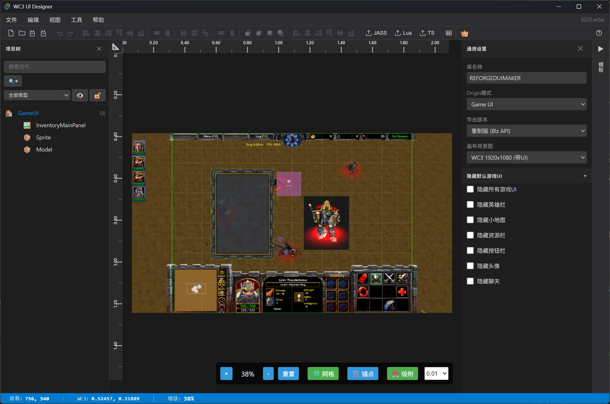

# Warcraft III UI Designer

<div align="center">



**专业的魔兽争霸3界面设计工具**

[](https://github.com/warcraft-iii/UI-Designer)
[](LICENSE)
[](https://tauri.app/)
[](https://reactjs.org/)

[English](#) | [简体中文](#)

</div>

---

## ✨ 特性

### 🎨 可视化设计
- **所见即所得** - 实时预览UI效果
- **19种控件类型** - 支持所有魔兽3原生控件
- **精确布局** - 智能参考线、标尺、网格吸附
- **多选操作** - Ctrl/Shift多选，批量编辑

### 🛠️ 专业工具
- **智能对齐** - 自动显示对齐参考线
- **样式预设** - 保存和快速应用样式配置
- **控件分组** - 批量管理和操作
- **搜索筛选** - 按名称、类型、属性快速查找

### 📦 导入导出
- **FDF导入** - 导入官方UI文件作为模板
- **多格式导出** - JASS/Lua/TypeScript/FDF
- **图片导出** - PNG截图和预览
- **项目文件** - .w3ui格式完整保存

### ⚡ 高效工作流
- **完整撤销/重做** - 支持所有操作历史
- **60+快捷键** - 类似VS Code的快捷键体验
- **模板系统** - 内置常用UI组件模板
- **阵列系统** - 快速创建技能栏、背包等
- **自动更新** - 基于GitHub Release的自动更新功能

---

## 🚀 快速开始

### 安装

#### Windows
```bash
# 下载最新版本
# 访问 Releases 页面下载 .exe 安装包
```

#### 从源码构建
```bash
# 克隆仓库
git clone https://github.com/warcraft-iii/UI-Designer.git
cd UI-Designer

# 安装依赖
bun install

# 开发模式
bun tauri dev

# 构建发布版本
bun tauri build
```

### 系统要求
- **操作系统**: Windows 10/11, macOS 10.15+, Linux
- **内存**: 至少 2GB RAM
- **磁盘**: 100MB 可用空间

---

## 📖 使用指南

### 创建你的第一个UI

1. **新建项目**: `Ctrl+N` 或点击工具栏"新建"按钮
2. **添加控件**: 从左侧模板面板拖拽或使用快捷键创建控件
3. **编辑属性**: 右侧属性面板调整位置、大小、样式等
4. **保存项目**: `Ctrl+S` 保存为 `.w3ui` 格式
5. **导出代码**: 导出为 JASS/Lua 代码用于地图

### 快捷键

| 功能 | 快捷键 |
|------|--------|
| 新建项目 | `Ctrl+N` |
| 打开项目 | `Ctrl+O` |
| 保存项目 | `Ctrl+S` |
| 撤销 | `Ctrl+Z` |
| 重做 | `Ctrl+Y` |
| 复制 | `Ctrl+C` |
| 粘贴 | `Ctrl+V` |
| 删除 | `Delete` |
| 全选 | `Ctrl+A` |
| 搜索 | `Ctrl+F` |
| 快捷键帮助 | `F1` |

**更多快捷键**: 按 `F1` 查看完整列表

---

## 🎯 核心功能

### 控件类型支持

```
✅ BACKDROP         - 背景/容器
✅ BUTTON           - 普通按钮
✅ TEXT_FRAME       - 文本显示
✅ EDITBOX          - 单行输入框
✅ TEXTAREA         - 多行文本域
✅ SLIDER           - 滑块控件
✅ CHECKBOX         - 复选框
✅ SIMPLE_STATUS_BAR - 简单状态栏
✅ SIMPLE_BUTTON    - 简单按钮
✅ HIGHLIGHT        - 高亮效果
✅ CONTROL_BACKDROP - 控制背景
✅ DIALOG_BACKDROP  - 对话框背景
✅ GLUE_TEXT_BUTTON - 胶水文本按钮
✅ GLUE_BUTTON      - 胶水按钮
✅ SCROLL_BAR       - 滚动条
✅ LIST_BOX         - 列表框
✅ MENU             - 菜单
✅ POPUPMENU        - 弹出菜单
✅ MODEL            - 3D模型
```

### 导出示例

#### JASS
```jass
library UILib initializer Init
globals
    framehandle myButton = null
endglobals

function CreateFrames takes nothing returns nothing
    set myButton = BlzCreateFrame("BUTTON", BlzGetOriginFrame(ORIGIN_FRAME_GAME_UI, 0), 0, 0)
    call BlzFrameSetAbsPoint(myButton, FRAMEPOINT_CENTER, 0.4, 0.3)
    call BlzFrameSetSize(myButton, 0.12, 0.04)
    call BlzFrameSetText(myButton, "点击我")
endfunction

function Init takes nothing returns nothing
    call CreateFrames()
endfunction
endlibrary
```

#### Lua
```lua
local myButton = BlzCreateFrame("BUTTON", BlzGetOriginFrame(ORIGIN_FRAME_GAME_UI, 0), 0, 0)
BlzFrameSetAbsPoint(myButton, FRAMEPOINT_CENTER, 0.4, 0.3)
BlzFrameSetSize(myButton, 0.12, 0.04)
BlzFrameSetText(myButton, "点击我")
```

---

## 🏗️ 技术架构

### 技术栈

- **前端框架**: React 19 + TypeScript 5.8
- **桌面框架**: Tauri 2.0
- **状态管理**: Zustand 5
- **构建工具**: Vite 7
- **UI渲染**: Canvas + CSS

### 项目结构

```
wc3-ui-designer/
├── src/
│   ├── components/      # React组件
│   ├── store/          # Zustand状态管理
│   ├── commands/       # 命令模式（撤销/重做）
│   ├── utils/          # 工具函数
│   ├── types/          # TypeScript类型定义
│   └── templates/      # UI模板
├── src-tauri/          # Tauri后端
├── docs/               # 文档
└── tests/              # 测试文件
```

### 优势

| 对比项 | 本项目 | Electron方案 |
|--------|--------|--------------|
| 包大小 | ~10MB | ~150MB |
| 启动速度 | <1秒 | ~3秒 |
| 内存占用 | ~50MB | ~150MB |
| 技术栈 | 现代化 | 传统 |

---

## 🤝 贡献

欢迎贡献代码、报告问题或提出建议！

### 开发指南

```bash
# 1. Fork 本仓库
# 2. 创建特性分支
git checkout -b feature/amazing-feature

# 3. 提交更改
git commit -m 'Add some amazing feature'

# 4. 推送到分支
git push origin feature/amazing-feature

# 5. 开启 Pull Request
```

### 开发规范

- 使用 TypeScript 严格模式
- 遵循 React Hooks 最佳实践
- 所有操作必须支持撤销/重做
- 添加适当的注释和文档

---

## 📝 文档

- [功能特性](docs/FEATURES.md) - 详细功能说明
- [快速开始](docs/QUICKSTART.md) - 快速入门教程
- [用户指南](docs/USER_GUIDE.md) - 完整使用手册
- [开发路线](docs/ROADMAP.md) - 未来规划
- [FDF解析器](docs/FDF_PARSER_GUIDE.md) - FDF导入详解
- [更新器配置](docs/UPDATER_GUIDE.md) - 发布和更新指南

---

## 🐛 问题反馈

遇到问题？请访问 [Issues](https://github.com/warcraft-iii/UI-Designer/issues) 页面报告

在提交问题前，请确保：
- 搜索现有问题，避免重复
- 提供详细的复现步骤
- 附上截图或错误日志
- 说明操作系统和版本号

---

## 📜 更新日志

### v0.1.0 (2025-11-09)
- ✨ 初始版本发布
- ✅ 完整的UI编辑功能
- ✅ FDF导入导出支持
- ✅ JASS/Lua/TypeScript代码生成
- ✅ 智能参考线和标尺
- ✅ 样式预设系统
- ✅ 60+快捷键支持
- ✅ 基于GitHub Release的自动更新功能

查看 [完整更新日志](docs/RELEASE_NOTES_v0.4.md)

---

## 📄 开源协议

本项目采用 [MIT License](LICENSE) 开源协议

---

## 🙏 致谢

- [Warcraft III](https://www.blizzard.com/zh-cn/games/warcraft-3) - 暴雪娱乐
- [Tauri](https://tauri.app/) - 现代桌面应用框架
- [React](https://reactjs.org/) - UI框架
- 所有贡献者和用户

---

## 🔗 相关链接

- [官方网站](#)
- [在线文档](#)
- [讨论论坛](#)
- [视频教程](#)

---

<div align="center">

**如果这个项目对你有帮助，请给一个 ⭐ Star！**

Made with ❤️ by Warcraft III Community

</div>
